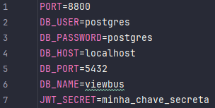

# SAEP - Back-End

## Como Inicializar

### 1. Clone o repositório
Clone o repositório para sua máquina via git ou baixando o arquivo .zip, 
disponíveis no botão **code**, na página principal;  

### 2. Abra um novo banco de dados
Abra um novo banco de dados PostgreSQL com usuário, senha, host, port e nome à sua preferência.  

### 3. Crie um arquivo `.env` na pasta principal do projeto (viewbus);
A pasta principal é aquela que contém o arquivo `package.json` dentro dela.

### 4. Coloque as variáveis de ambiente abaixo, correspondentes ao banco de dados que você criou e às suas preferências:  
   - PORT: PORT de execução do projeto;
   - DB_USER: Nome do usuário do banco de dados que você criou;
   - DB_PASSWORD: Senha do banco de dados que você criou;
   - DB_HOST: Host do banco de dados que você criou;
   - DB_PORT: Porta do banco de dados que você criou;
   - DB_NAME: Nome do banco de dados que você criou;
   - JWT_SECRET: chave secreta para criptografia. Coloque qualquer texto de sua preferência. 
   Se utilizar espaços, será necessário botar em volta de aspas ou simples, ou duplas.
### Exemplo de arquivo `.env`:  

### 5. Rode o Projeto
Abra o terminal na pasta principal (pasta que contém o arquivo `package.json`), e execute o seguinte comando:
`npm run start`.

### 6. Feito! Agora é só usar!
Consuma a API através de seus endpoints, recomenda-se utilizar um aplicativo especializado, 
como o **[Postman](http://postman.com/)** ou **[Insomnia](http://insomnia.rest/)**.